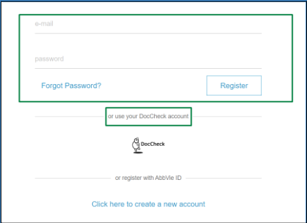

# **Project: AbbViePro**

_Project Background:_ The Global HCP portal aims to create a digital standard for HCP audiences who seek AbbVie Products and Services.

_Technology Used:_ AEM, AngularJS, Java, Javascript, HTL, Sling, JCR, Maven etc.

_Project URL:_ [https://www.abbviepro.com/](https://www.abbviepro.com/)

## Role: Test Engineer

## Work Duration: 2019 - 2022

## _Responsibilities:_

* Developed and executed comprehensive test plans, including functional, integration, regression, and sanity testing.
* Led a team of testers in executing test plans, including functional, regression, and test documentation, pre-release and post-release activities.
* Coordinated with business analysts to understand user requirements and expectations.
* Utilized Jira, Confluence, and Trello for test case management, defect tracking, and project progress reporting.

## _Challenges:_

* Faced challenges in ensuring seamless integration of different features without affecting the existing functionality.
* Coordinating with teams in different time zones led to communication challenges and required efficient use of collaboration tools.
* Ensuring a consistent user experience on devices with different screen sizes and resolutions.
* Verifying that changes made to address compatibility did not negatively impact the platform's performance.

## _Solution:_

* Created a matrix detailing the specific combinations of browsers, versions, and devices to be tested.
* Collaborated with the development team to implement a robust solution without compromising other system features.
* Utilized Jira for bug tracking, ensuring clear communication among team members about identified issues and their resolutions.
* Implemented cypress automation on some important features to reduce regression testing time.

## _Achievements:_

* Successfully integrated automated testing using Cypress, resulting in a 20% reduction in regression testing time.
* Successfully met project deadlines, delivering intricate features like user authentication, search functionality, and article filtering within the specified time frame, ensuring project milestones were achieved punctually.
* Received positive feedback from the product team, indicating improved customer satisfaction and platform reliability.

  

# Tested Key Features :

1. **Secure User Authentication and Login:**

Rigorously tested different types of user authentication systems (Third-party integration registration/login, campaign ID login, etc) with effective test data ensuring the confidentiality of user credentials and protecting sensitive product information.

2. **Filter and display articles:**

    Conducted in-depth testing on article filtering options, allowing users to refine search results based on different article tag type calculations. Ensured a seamless and efficient article browsing experience on different devices. Also ensured displaying article data according to user’s authentication.

3. **Effective Campaign ID Integration:**

    Successfully integrated and validated the use of Campaign IDs for tracking and analyzing marketing campaign effectiveness. Collaborated with the development team to ensure seamless integration without disrupting other functionalities.

4. **Complex Multi-layer and Functional header:**

    Thoroughly tested a complex multi-layer header, ensuring seamless navigation, responsiveness, and dynamic functionality. Implemented user authentication variations for distinct navigation items, enhancing user-specific experiences.

5. **Search Functionality:**

    Conducted thorough testing on the search functionality, optimizing keyword search, and showing results according to different user access areas. Achieved accurate and swift search results, enhancing the overall user experience.

                                     Copyright © Noor Ismot Ara- All rights reserved
